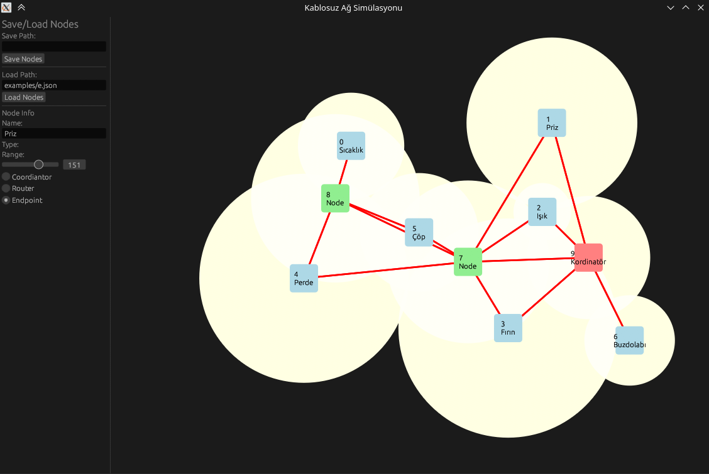

# SimpleNetwork Simulation App

This project is a Node Movement Application built using Rust and the `eframe` and `egui` libraries. It allows users to generate, move, and manage nodes within a graphical interface for basic network structer.



## Features

- Add new nodes by right-clicking on the canvas.
- Drag and drop nodes to reposition them.
- Edit node properties such as name, type, and range.
- Save and load node configurations to and from JSON files.

## Exalples
You can find some examples on `examples` folder

## Node Types

- **Coordinator**: Represented by a red color.
- **Router**: Represented by a green color.
- **Endpoint**: Represented by a blue color.

## Getting Started

### Prerequisites

- Rust and Cargo installed. You can download them from [rust-lang.org](https://www.rust-lang.org/).

### Installation

1. Clone the repository:
    ```sh
    git clone https://github.com/halak0013/network_visu
    cd network_visu
    ```

2. Build the project:
    ```sh
    cargo build
    ```

3. Run the project:
    ```sh
    cargo run
    ```

## Usage

- **Add Nodes**: Right-click on the canvas to create a new node at the mouse position.
- **Dragging Nodes**: Click and drag a node to move it around the canvas.
- **Editing Nodes**: Select a node by clicking on it. Edit its properties in the side panel.
- **Saving Nodes**: Save the current node configuration to a JSON file.
- **Loading Nodes**: Load a node configuration from a JSON file.

